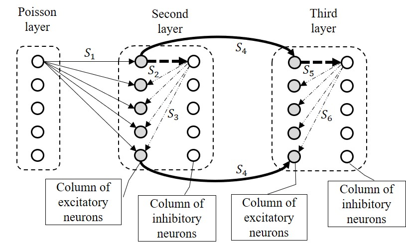
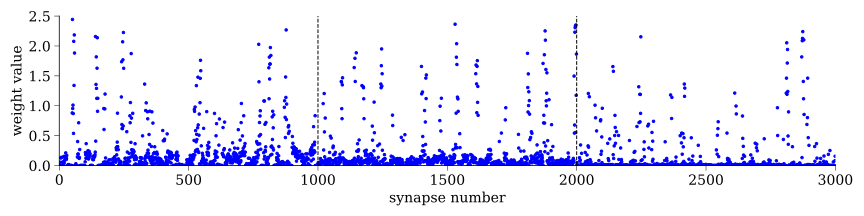
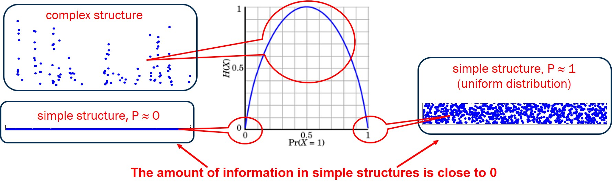
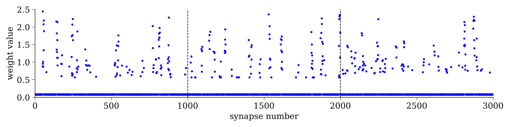

# __Systems theory principles for investigating the spiking neural network trained with the Hebbian rule__   
The code illustrates the result reported at the [Neuroinformatics-2024](https://neuroinfo.ru/index.php/en/) conference and published in [Proceedings of conference](https://www.researchgate.net/publication/385349463_Systems_Theory_principles_for_investigating_the_spiking_neural_network_trained_with_the_Hebbian_rule).
***
### ARTICLE:   
Antonov, D.I. "Systems theory principles for investigating the spiking neural network trained with the Hebbian rule." Proceedings of XXVI International Conference on Artificial Neural Networks NEUROINFORMATICS-2024. MIPT (Moscow Institute of Physics and Technology). Moscow. Russia. 2024 October. pp. 33-42.   
***
Abstract: The article presents the results of research on the synaptic weights distribution obtained by applying a new local learning rule for spiking neural networks (SNNs). The developed method uses a combination of Hebbian rules: spike-time dependent plasticity (STDP) and long-term depression (all-LTD). The synaptic weights distribution of a 3-layer SNN trained according to the com-bined rule allowed, after training, to restructure the synaptic weights distribution of SNN based on the principles of Systems Theory.
***
__The code is written in Python 3.8 using the Brian 2.0 framework.__   
***
The work is devoted to the study of the structure of synaptic weights of a spiking neural network (SNN). The SNN architecture used for the 2-layer case was described in our [previous paper](https://ieeexplore.ieee.org/document/10582358). In this paper, a 3-layer architecture was used:    

The SNN was trained using the _'STDP+all-LTD'_ method, based on two biologically plausible learning rules: canonical Hebbian spike-timing-dependent plasticity (STDP) and all-time long-term depression (all-LTD).    
For a description of the _'STDP+all-LTD'_ method, see [code and description](https://github.com/dmitryanton68/learning_rule_STDP_all-LTD).       

The SNN was trained in 2 stages:    
- first, the synaptic group _S1_ was trained according to the canonical STDP rule, which leads to the clustering of data features (_Preliminary_Model.ipynb_ file), then,    
- in the second stage, the synaptic group _S4_ was trained according to the combined Hebbian rule _‘STDP + all-LTD’_ (_Model_STDP+all-LTD_ _ _(weights_plane+compression).ipynb_ file).

***
The result of network training is the distribution of synaptic weights. The weight distribution of _S4_ group allows a clear visual representation on the graph:   

In the experiments, excitatory neurons of the third layer, according to the _‘STDP + all-LTD’_ rule, were divided into 3 subsets, each of which was respon-sible for classifying one of the 3 classes of data (the subset number coincided with the class number). The synapses of _S4_ group are associated to the three 10-element subsets (10 × 3 = 30) of the third layer excitatory neurons.
Visually, the figure above shows a densely distributed subsystems of lighter weights (_‘light’_ weights at the bottom of the graph) and a less densely distributed subsystems of heavier weights (_‘heavy’_ weights at the top).
The densities of the _‘light’_ weight subsystem and the _‘heavy’_ weight subsystem within the subgroup are quite constant. The analysis showed that different distributions of weights in subgroups are directly related to different degrees of class definition accuracy.
Each weights subgroup is associated with the definition of one class, and the best classification accuracy was shown by the subgroup in which:
•	_‘light’_ weights are distributed so that they occupy a relatively wider range,
•	the distribution of _‘light’_ weights (without taking into account weights with 0 value) is close to a uniform distribution,
•	the sum of the _‘heavy’_ weights is maximal,
•	dividing the weights into _‘heavy’_ and _‘light’_ ones is most effective if the number of _‘heavy’_ weights is about 10% of the number of all weights (the rest are the _‘light’_ ones). This result is consistent with [our previous research](https://doi.org/10.1016/j.neunet.2022.09.003) regarding the importance of weights for classification accuracy.    

The best value for the point separating _‘light’_ and _‘heavy’_ weights was determined as the inflection point of the weight density distribution curve of the subgroup that had the maximum sum of _‘heavy’_ weights (the inflection point mentioned below refers specifically to this class).
***
__Our assumption__
Synapses have different roles in performing classification:
- ones of them maintain a minimum potential level in an excitatory neurons (synapses with _'light'_ weights),
- the remaining force excitatory neurons to ‘fire’, sharply increasing their potential above the threshold (synapses with _'heavy'_ weight).

In other words, the most of the amount of information in the synaptic weights structure is located in the upper (_'heavy'_) weights subsystem:

***
This distribution of the amount of information allows replacing all the weights of the _'light'_ weight subsystem with a single value:

__Replacing 90% of the weights with a single value allows us to reduce the SNN size by 10 times__, which significantly reduces the hardware requirements for model deployment.
***
***

